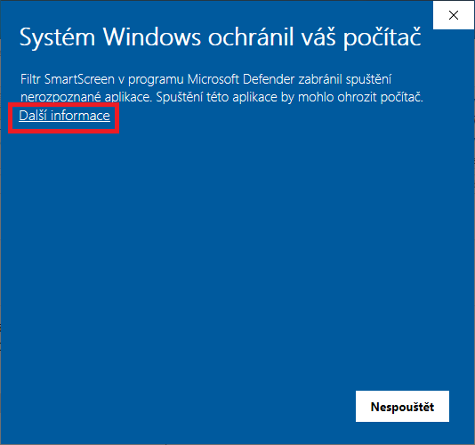
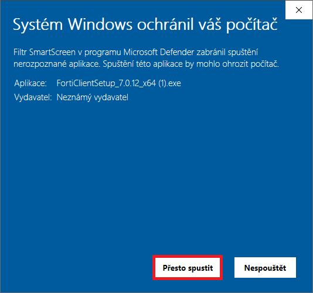
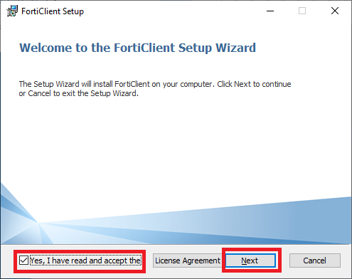
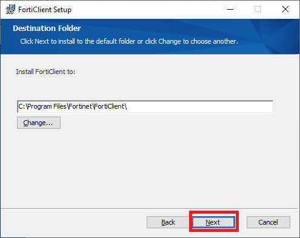
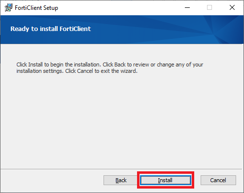
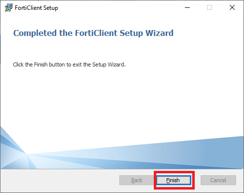
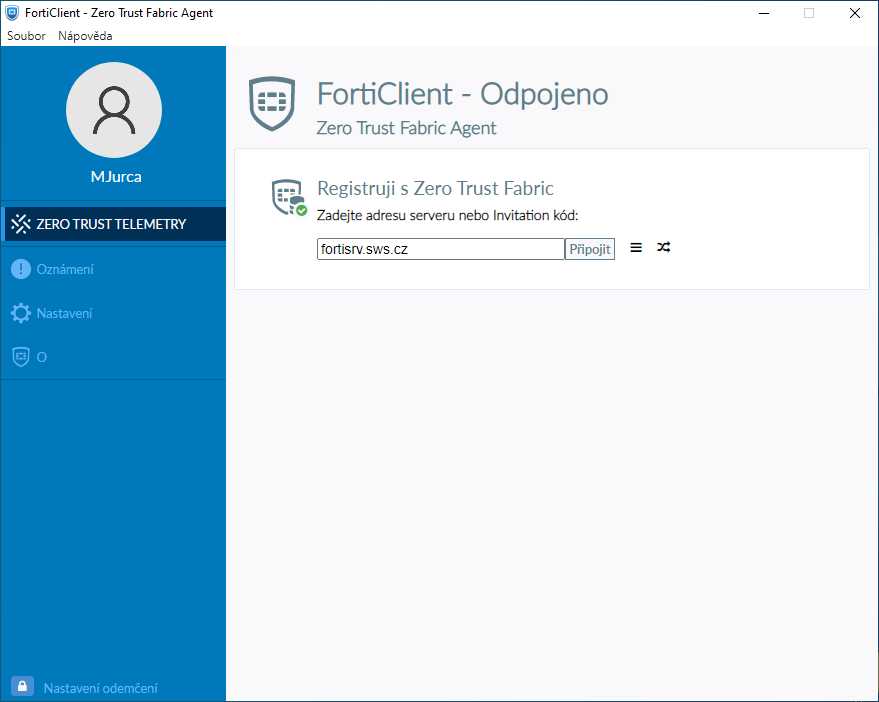
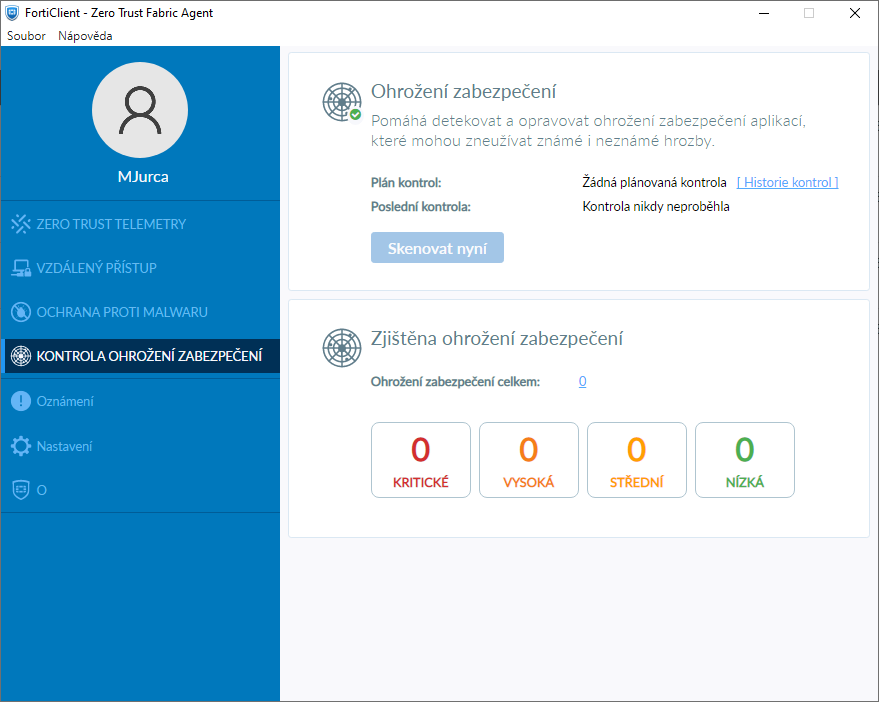

# FortiClient

## Stažení a instalace FortiClienta
* Stáhnout instalační soubor ze [Sharepointu](https://sws-my.sharepoint.com/:f:/g/personal/mjurca_sws_cz/Eo8LHrIaLx1Euv7AoELomwABdG4QXYPyTK6Qfu27eYhgGw?e=7h1FDx)
* Spustit instalační soubor a rozkliknout **Další informace**
  
  

* Kliknout na **Přesto spustit**

  

* Zaškrtnout **souhlas s licenční smlouvou** a kliknout na **Další**

  
* Kliknout na **Další**

   
* Kliknout na **Nainstalovat**

  
* Po instalování kliknout na **Dokončit**

  

## Nastavení FortiClienta
* Na ploše najít ikonku FortiClienta a otevřít
* V záložce **ZERO TRUST TELEMETRY** nastavit **fortisrv.sws.cz** a **Připojit**
 
  

* Cílem je, aby v záložce **KONTROLA OHROŽENÍ ZABEZPEČENÍ** nic nebylo

  