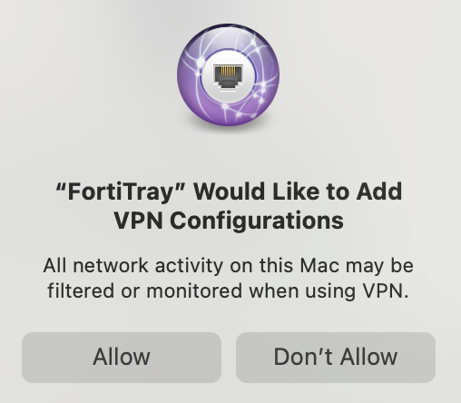
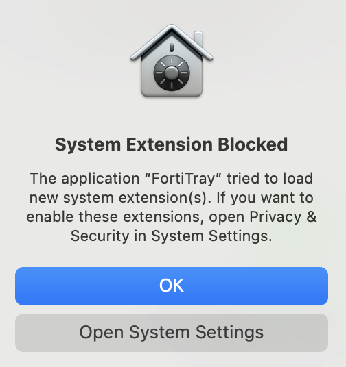
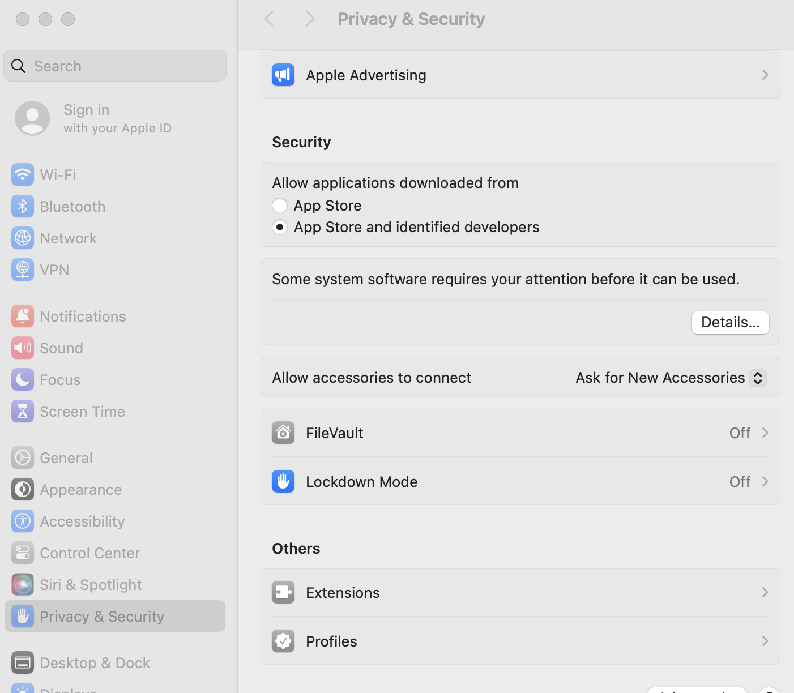
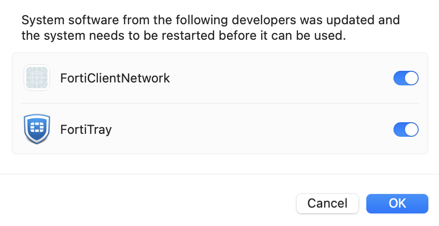
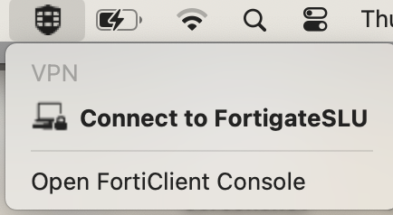
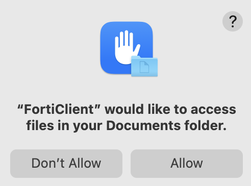
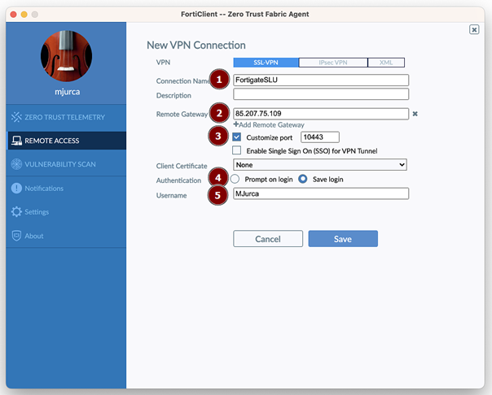
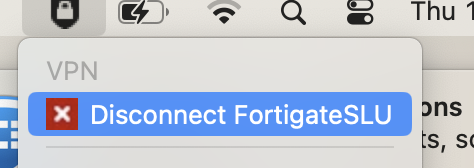

# FortiClient

## Download and installation

* Download the installation file from [Sharepoint](https://also-my.sharepoint.com/:f:/p/michal_jurca/EqknBXe9uj9Op_06uL-_yCEBmEdUnFIgIoQ_9jCMXD1j8w?e=9ezEaW)
* Open the downloaded **.dmg** file and run **Install.mpkg**
* The FortiClient VPN Installer window will appear. During the installation, you will receive the several prompts - continue, continue, continue, install, close.
* Click **Allow** when you receive the following prompt

  

* Click **Open System Settings** when you receive the following prompt.

  

* In the **System Settings** window that appeared,  Click  **Details...**

  
* Click **Allow** for FortiTray and FortiClientNetwork

  
* Once the FortiClient installation is
completed, go to the FortiClient
menu icon. Click it, and select
**Open FortiClient Console.**

  
* You will receive a prompt  Click **OK** to allow
FortiClient to save its settings to
your profile.

  

## Desktop app settings

* Go to the FortiClient
menu icon. Click it, and select
**Open FortiClient Console.**
* Under the **Zero Trust Telemetry** tab, put **fortisrv.sws.cz**

* Under the **Remote Access** tab, click  **Configure VPN**

* Set up:

1. **FortigateSLU**
2. **85.207.75.109**
3. **Customize port 10443**
4. **Save login**
5. **Enter your login so that your first and last name always have the first initial letter capitalized**

  

## Mobile app settings

* The FortiToken Mobile app is available for android at [Google Play](https://play.google.com/store/apps/details?id=com.fortinet.android.ftm&amp;hl=cs&amp;gl=US) and for iOS at [App Store](https://apps.apple.com/us/app/fortitoken-mobile/id500007723)

* In the FortiToken Mobile app, scan the QR code that arrives in the email using the **Scan Barcode** function. The email with the QR code will be sent from **donotreply@notification.fortinet.net** and it will be valid for 72 hours

* To view the 6-digit code, click on the eye symbol

## Using the FortiClient

* **Login**

1. Go to the FortiClient
menu icon. Click it, and select
**Connect to FortigateSLU.**
  
2. Enter your password and click on **Connect**
3. Enter a 6-digit number from the mobile app

* **Logout**

1. Go to the FortiClient
menu icon. Click it, and select
**Disconnect to FortigateSLU.**
  

## Dificulties

* You are not in our domain. When the window appear, click **continue**. It will only appear once.  
  
* If you have trouble logging in, check **Zero trust telemetry** and put **fortisrv.sws.cz**
  

## Updates

A window will appear while the FortiClient is being updated. You can install it now or postpone it for later. After the update, all settings should be remembered, so no further configuration will be necessary.

  