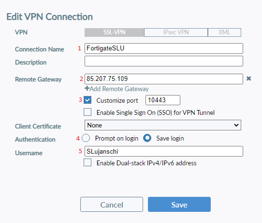
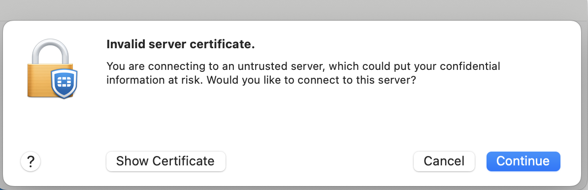
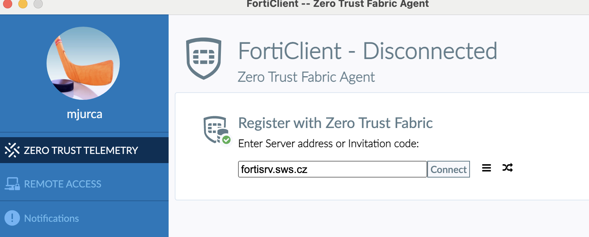
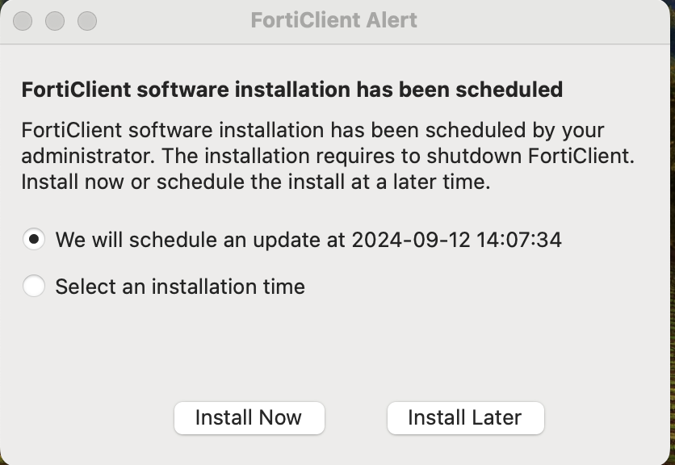

# FortiClient

## Desktop app settings
* Launch the Forticlient icon on the desktop 

* Under the **Remote Access** tab, click on **Configure VPN**

* Set up:
1. **FortigateSLU**
2. **85.207.75.109**
3. **Customize port 10443**
4. **Save login**
5. **Enter your login so that your first and last name always have the first initial letter capitalized**

## Mobile app settings

* The FortiToken Mobile app is available for android at [Google Play](https://play.google.com/store/apps/details?id=com.fortinet.android.ftm&amp;hl=cs&amp;gl=US) and for iOS at [App Store](https://apps.apple.com/us/app/fortitoken-mobile/id500007723)

* In the FortiToken Mobile app, scan the QR code that arrives in the email using the **Scan Barcode** function. The email with the QR code will be sent from **donotreply@notification.fortinet.net** and it will be valid for 72 hours

* To view the 6-digit code, click on the eye symbol

## Using the FortiClient

* **Login**
1. Launch the Forticlient icon on the desktop and select **Remote Access**
2. Enter your password and click on **Connect**
3. Enter a 6-digit number from the mobile app 

* **Logout**
1. Launch the forticlient icon on the desktop and select **Remote Access**
2. Click on **Disconnect**

## Dificulties

* You are not in our domain. When the window appear, click **continue**. It will only appear once.  
  
* If you have trouble logging in, check **Zero trust telemetry** and put **fortisrv.sws.cz**
  

## Updates

A window will appear while the FortiClient is being updated. You can install it now or postpone it for later. After the update, all settings should be remembered, so no further configuration will be necessary.

  