# Nastavení

1.  Přihlásit se na [mysignins.microsoft.com/security-info](https://mysignins.microsoft.com/security-info)

2. Kliknout na **Přidat metodu přihlašování**

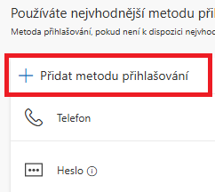

3. Z možností vybrat **Microsoft Authenticator**

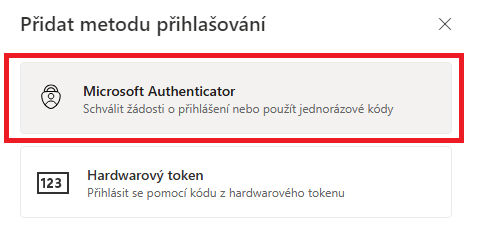

4. Kliknout na  **Chci použít jinou ověřovací aplikaci**

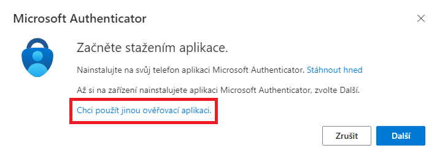

5. Kliknout na  **Další**

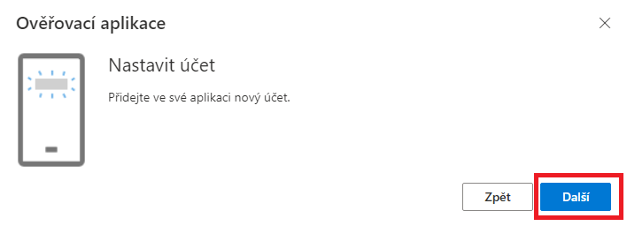

6. Kliknout na  **Nedaří se obrázek naskenovat?**

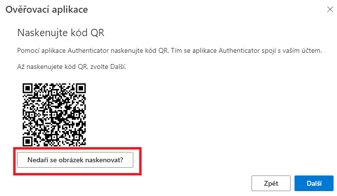

7. Následně se zobrází **Název účtu** a **Tajný klíč**, který se zkopíruje do aplikace v kroku č. 15

8. Ve Windows vyhledat **Microsoft Store**

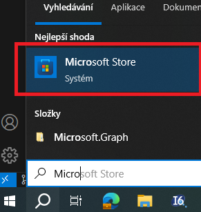

9. V Microsoft Store vyhledat **FortiToken Windows** a kliknout na to

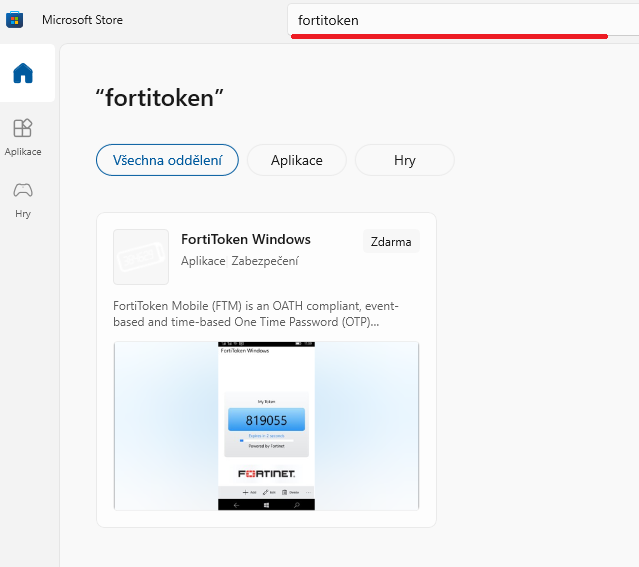

10. Potom kliknout na **Získat**

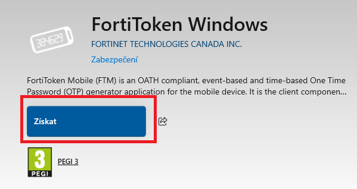

11. Po nainstalování kliknout na **Otevřít** 

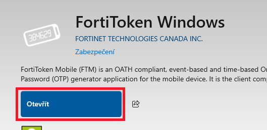

12. V pravo dole kliknout na **Add**

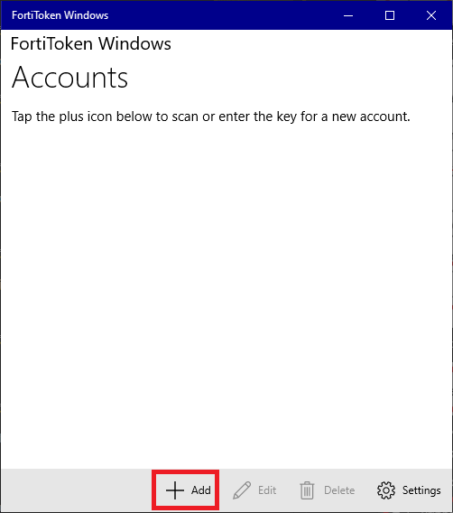

13. Nyní se vloží **Název účtu** a **Tajný klíč**  a je potřeba vybrat **3rd Party**

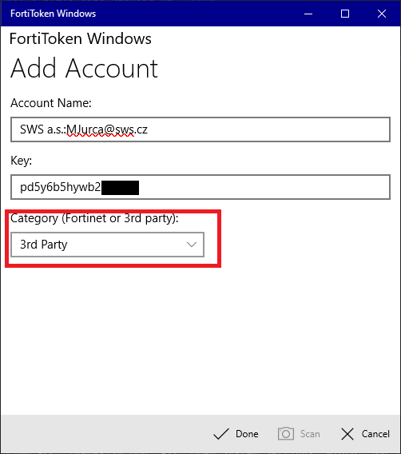

14. V pravo dole kliknout na **Done**

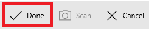

15. V liště kliknout na ikonku pravým tlačítkem myši a vybrat **Připnout na hlavní panel** pro lepší nalezení aplikace

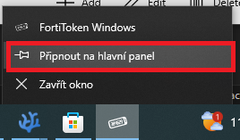

16. Nyní se vrátit do prohlížeče, kde se generoval ten Tajný klíč a kliknout na **Další**

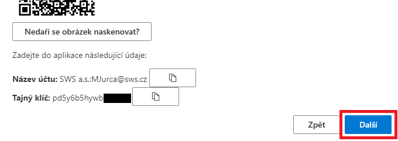

17. Vložit 6číselný kód z aplikace a dát **Další**

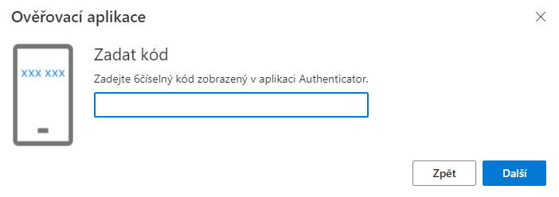

18. Hotovo, nyný jenom zadávat kód z aplikace, když to jednou za čas vyzve

# Použití:

1. Najít aplikaci s ověřovacím kódem. Pokud není v liště aplikace připnutá tak ve Windows vyhledat

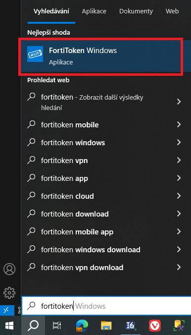

2. Opsat kód do přihlašovacího okna

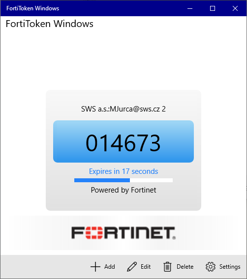

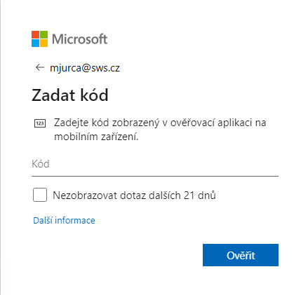