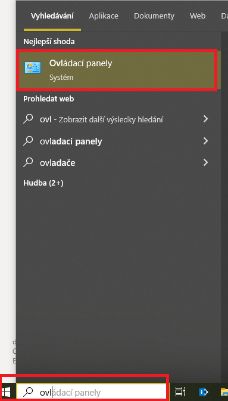
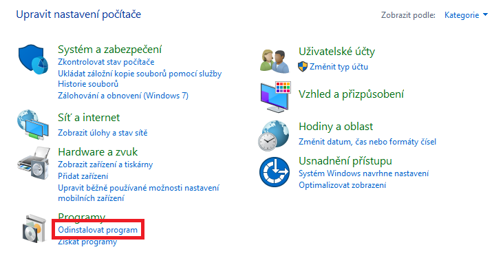
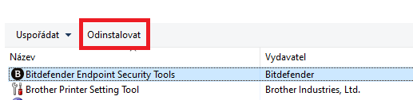
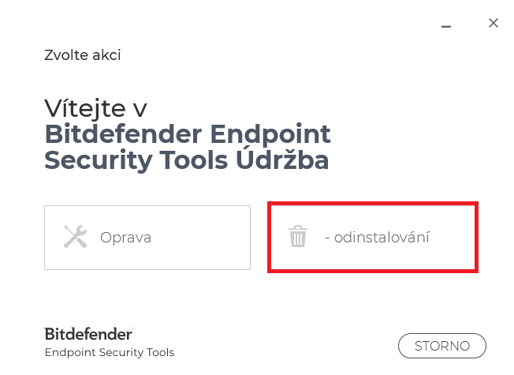
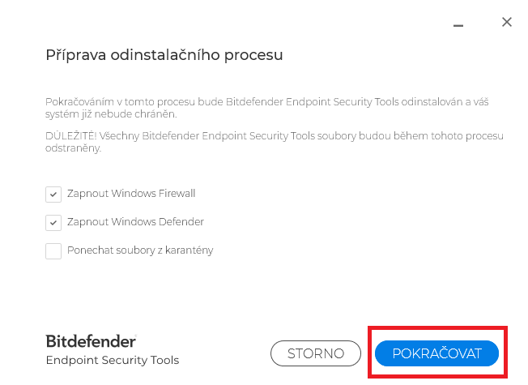
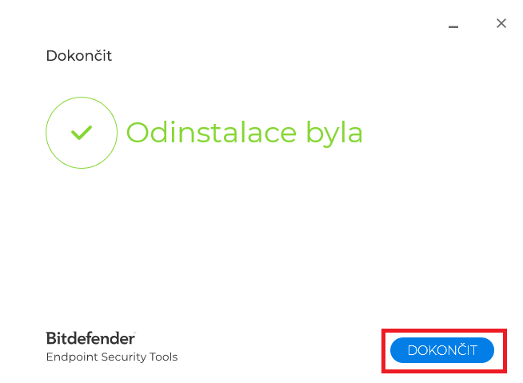
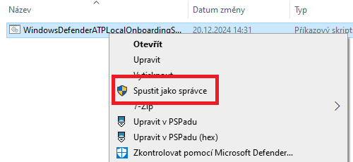
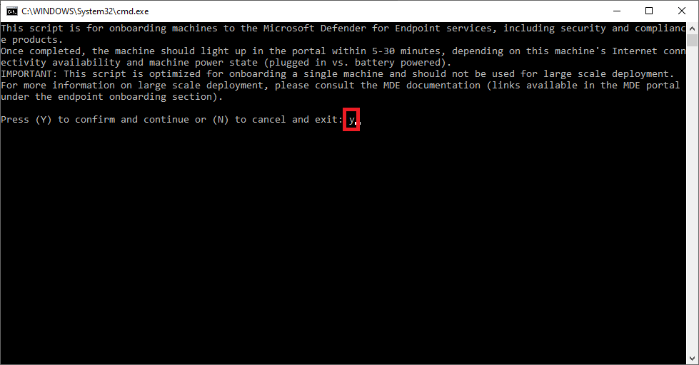
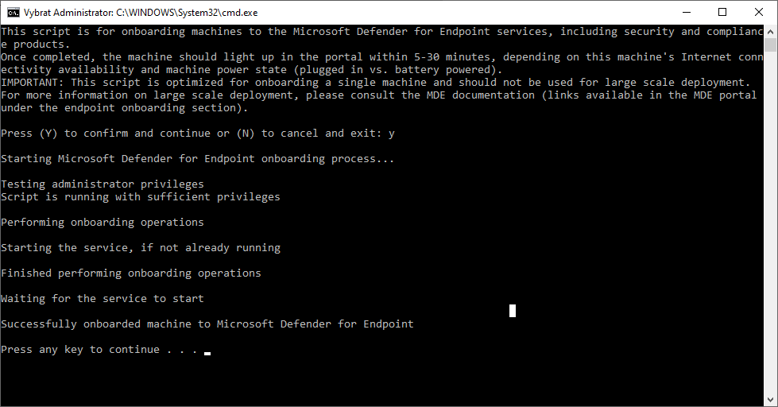

# Microsoft Defender 

## Odinstalování Bitdefenderu

1. Dát Start ve windows a vyhledat **Ovládací panely**

2. V ovládacích panelech kliknout na **Odinstalovat program**

3. Najít Bitdefender Endpoint Security Tools a dát  **Odinstalovat**

4. Otevře se okno a vybrat **Odinstalování**

5. Jenom kliknout na   **Pokračovat**

5. Kliknout na  **Dokončit**

## Spuštění Also skriptu

1. Also script je umístěň na disku  **Q:\ALSO_MSDefender** (`\\diskstation\Synology\ALSO_MSDefender`) a je potřeba ho překopírovat k sobě do NB třeba na plochu  **kliknout pravým** tlačítkem na něho a vybrat **Spustit jako správce** 

2. Při výzvě zmáčknout **y** a enter

3. Počkat než se to dokončí a pak cokoliv zmáčknout na klávesnici

