# WebService – Katalog exportů (`ResultList.config` + `ResultListUser.config`)

> **Účel dokumentu:** Kompletní popis všech exportů (resultType) definovaných v konfiguračních
> souborech `ResultList.config` (systémové/standardní exporty) a `ResultListUser.config`
> (zákaznické/speciální exporty `X-…`) pro účely předání a integrace pod ALSO.
> Navazuje na `webservice.md` (architektura, autentizace, formát volání) a `products.md`
> (srovnání s ALSO Product API).
>
> ⚠️ **Stav dokumentu:** Popisy vycházejí z analýzy SQL definic v konfiguračních souborech.
> Místa označená `‹…›` je vhodné ověřit proti reálnému provozu.

---

## 1. Jak číst tento katalog

### 1.1 Volání exportů

Každý export se volá přes `Default.asmx` jednou ze tří metod:

```
GET /i6ws/Default.asmx/GetResult?resultType=‹NAME›
GET /i6ws/Default.asmx/GetResultByCode?resultType=‹NAME›&code=‹CODE›
GET /i6ws/Default.asmx/GetResultByFromTo?resultType=‹NAME›&from=‹FROM›&to=‹TO›
```

Varianty `resultType`: `‹NAME›` (data), `‹NAME›_El` (elementová varianta XML),
`‹NAME›_Schema` (XML schema odpovědi).

### 1.2 Standardní parametry SQL příkazů

| Parametr | Zdroj | Význam |
|---|---|---|
| `UserConId` | Identity (přihlášený wslogin) | ID kontaktu partnera v I6 (`ConId`) — řídí oprávnění, ceny, viditelnost dat |
| `ParamCode` | `code` z URL | Filtr — kód produktu / ID / podmínka (viz prefixy níže) |
| `ParamFrom`, `ParamTo` | `from`/`to` z URL | Rozsah (typicky datum poslední změny `StiU`/`SipU`, u dokladů datum dokladu) |
| `AppSettingsTaxMeCouId` | AppSettings | ID země pro přepočet sazby DPH (přeshraniční režim) |
| `Options` | URL | Doplňkové přepínače (jen u feedů, např. `|ShoptetStrict|`) |

### 1.3 Rozšířené vyhledávání — prefixy `code`

Většina produktových exportů (označeno „**Prefixy: ano**") podporuje prefix na začátku
parametru `code`, který určuje pole filtru (bez prefixu = hlavní kód `StiCode`):

| Prefix | Filtruje podle | Příklad |
|---|---|---|
| *(žádný)* | Hlavní skladový kód (`StiCode`) | `code=0320663` |
| `{StiId}` | Interní ID produktu | `code={StiId}685699` |
| `{PartNo}` | Výrobní číslo | `code={PartNo}GU605CX-QR149` |
| `{PartNo2}` | Druhé výrobní číslo | `code={PartNo2}90NR0M65-M007X0` |
| `{CodeEAN}` | EAN | `code={CodeEAN}4711636262347` |
| `{ManName}` | Název výrobce (kategorie `MAN`) | `code={ManName}ASUS` |
| `{CodeAll}` | Libovolný evidovaný kód (`StoItemCode`) | `code={CodeAll}…` |

> **Hromadný dotaz:** Do `code` lze vložit **více hodnot oddělených tabulátorem** (`\t`).
> Prefix se uvádí jednou na začátku a platí pro celou dávku.

### 1.4 Základní podmínka viditelnosti produktů

Není-li partnerovi v I6 nastavena vlastní podmínka (`I6WSCONDITION` v PerRDef), platí pro
téměř všechny produktové exporty:

```sql
StiHide = 0 AND COALESCE(StiHideWS, StiHideI) = 0
AND StiOrdCus = 1 AND StiOrdCusI = 1 AND StiPL = 1
```

(produkt není skrytý, není skrytý pro WS/internet, je objednatelný zákazníkem a je v ceníku).
Dále se aplikuje `WsRowPermissionsApply` (řádková oprávnění per partner) a případný filtr
`ConXAppId` → `StiHideIList` (skrytí podle aplikace).

> **Výjimky per zákazník:** V hlavičce `ResultList.config` jsou komentářem popsané výjimky
> (ATB — jen ROOT element; ELVC/ELS/ELP — `+ StiSL = 1` a bez časového omezení;
> PEL/MEZ/MER/KAP — `StoItemShop_El` zahrnuje i varianty sestav; SWK — zrušeno).
> Při migraci je nutné zohlednit, že nasazené konfigurace se u těchto partnerů liší.

### 1.5 Nastavení per partner (TabSet / fGetPar)

Chování exportů dále mění parametry v I6 (tabulka `TabSet`, funkce `fGetPar`):

| Parametr | Efekt |
|---|---|
| `WsEAN` | SQL zdroj EAN/EAN2 (může být jiný per partner, `#COMID#` substituce) |
| `WsPriceCur` = `ComXCurId` | Přepočet cen do měny partnera aktuálním kurzem (`RttIdOrd1`) |
| `WsSipPriceEU` | Zdroj koncové ceny `PriceEU` (sloupec `StoItemPrice` nebo funkce `dbo.f…`) |
| `WsPrcB2CMin` | Zdroj minimální B2C ceny `PriceB2CMin` (sloupec nebo vzorová firma) |
| `WsQtyFree0` | 1 = vracet i produkty s nulovou zásobou (`QtyFree=0`), 0 = nevracet |
| `WsFullTabUpd` (Field-QtyFree, Field-NoteDisable, Field-ImgInfoDisable, Result-StoItemPriceOrd-Fix…) | Per-partner zapnutí/vypnutí polí (sklad, poznámky, obrázky, fixní ceny) |
| `Result-SipPriceOrd-Fix` (ConParSet WSE) | Fixace jednotné ceny PriceOrd pro partnera |

### 1.6 Časová omezení (`Restriction`) a viditelnost (`Visibility`)

- `<Restriction Method="…" Hour="|08|…|20|" />` — povolené hodiny volání pro danou metodu
  (`""` = GetResult, `ByCode`, `ByFromTo`). Prázdné `Hour=""` znamená **metoda zakázána**.
  Exporty bez elementu `Restriction` jsou dostupné **nepřetržitě**.
- `<Visibility ComId="|0|6336|…|" />` — export je viditelný **jen vyjmenovaným firmám**
  (`ComId`). `|0|` = interní/systémové použití. Používá se hlavně v `ResultListUser.config`.
- `ResultListUser.config` má **přednost**: export stejného jména (např. `StoItemPriceOrd`)
  s `Visibility` přepisuje pro vyjmenované partnery definici z `ResultList.config`.

### 1.7 Konvence odpovědi

- Kořen `<Result>`; první atribut `Void` je rezervovaný (vždy prázdný) — slouží k tomu,
  aby se vygenerovala obálka i při prázdném výsledku.
- Exporty s obrázky vrací v `Result` atributy `UrlBase`, `UrlBaseImg`, `UrlBaseThumbnail`,
  `UrlBaseEnlargement`, `UrlBaseImgGalery` — plné URL se skládá jako `UrlBase… + Id`.
- Prázdné hodnoty se vynechávají (`NULLIF`), atributy s hodnotou 0/výchozí se negenerují.
- Vícejazyčnost: texty (`Name`, `Note`, …) se překládají per partner
  (`WsLngFieldsApply`).

---

## 2. Katalog exportů — `ResultList.config`

Přehled (50 exportů):

| Skupina | Exporty |
|---|---|
| Produkty – základ | `StoItemActive`, `StoItemBase`, `StoItemList`, `StoItemHook`, `StoItemSiv` |
| Feedy | `StoItemShop_El`, `StoItemShoptet_El`, `StoItemAukroMPOrder_El` |
| Ceny | `StoItemPriceOrd`, `StoItemPriceOrdCur`, `StoItemPriceEU` |
| Sklad | `StoItemQtyFree`, `StoItemQtyFreeBO`, `StoItemQtyFreeEx`, `StoItemQtyFreeExQud`, `StoItemQtyFreeExQudT` |
| Identifikátory | `StoItemEAN`, `StoItemEPREL`, `StoItemGPSR` |
| Kategorie/stromy | `SCategorySys`, `SPresentTreeType`, `SPresentTree`, `StoItemNode`, `StrStiSync` |
| Parametry/přílohy | `CpsSti`, `CpsStiVal`, `AttSti`, `AttCpsSti`, `StiPacking` |
| Vztahy | `StiRelation`, `StiRelationCO`, `Config` |
| Doklady | `DocTrInv`, `DocTrDel`, `DocTrExp`, `DocTrLoa` |
| Objednávky | `Order`, `OrderDelivMode`, `OrderPaymentMode`, `OrderQueue`, `OrderToken`, `Queue` |
| Firma/B2C | `Company`, `ZCompany`, `ComShipTo`, `ComBank`, `ZShop` |
| Reklamace/servis | `Reclaim`, `Service` |

---

### SCategorySys
Číselník **systémových kategorií** (typy kategorií se `SctSystem = 1`).
**Metody:** `GetResult`, `GetResultByCode` (`code` = `ScaCode`). **Omezení:** žádné (24/7). **Timeout:** 10 s.

| Pole | Typ | Popis |
|---|---|---|
| `Id` | i4 | ID kategorie (`ScaId`) |
| `Code` | string | Kód kategorie |
| `Name` | string | Název |
| `Note` | string | Poznámka (`ScsPLNote`) |

---

### StoItemActive
Seznam **aktivních produktů** — identifikátory bez cen a skladu. Vrací jen produkty
s **kladnou cenou** v cenové hladině partnera (`PrcId`). Vhodné jako denní „master list"
pro zjištění, co je v sortimentu (obdoba ALSO `AllProducts` na úrovni identifikace).
**Metody:** `GetResult`, `GetResultByCode`. **Prefixy: ano**, tab-dávka: ano. **Omezení:** žádné. **Timeout:** 600 s.

| Pole | Typ | Popis |
|---|---|---|
| `Id` | i4 | Interní ID produktu (`StiId`) |
| `Code` | string | Hlavní skladový kód |
| `StiCode2` | string | Alternativní kód |
| `PartNo`, `PartNo2` | string | Výrobní čísla |
| `EAN`, `EAN2` | string | EAN (zdroj dle `WsEAN`) |

---

### StoItemGPSR
**GPSR** (General Product Safety Regulation) informace o produktech — odpovědná osoba /
výrobce a bezpečnostní přílohy. Vrací jen produkty, které mají GPSR data
(`fGpsrManufacturer` / `fGpsrAttach`).
**Metody:** `GetResult`, `GetResultByCode`. **Prefixy: ano.** **Omezení:** žádné. **Timeout:** 600 s.

Struktura: `StoItem[@Id @Code @Code2 @PartNo @PartNo2 @EAN @EAN2 @Name]`
→ `Manufacturer[@Id @Name @Address @EMail @NameER @AddressER @EMailER]` (ER = zástupce pro EU)
→ `Link[@Id @Type @Name @Note @Url]` (bezpečnostní listy, návody; URL z galerie `img.asp?attid=`).

---

### StoItemBase
**Hlavní produktový export** — základní informace, ceny, dostupnost (příznak), obrázky,
recyklační poplatky, DPH, záruky. Pokrývá ALSO `AllProducts` / základ `ProductFullInfo`.
**Metody:** `GetResult`, `GetResultByCode` (**prefixy: ano**), `GetResultByFromTo`
(od/do = změna `StiU` nebo `SipU` — inkrementální stahování).
**⏱️ Omezení:** GetResult i ByFromTo **08:00–20:00**. **Timeout:** 600 s.
Vrací se jen produkty s `PriceOrd > 0`.

Atributy `Result`: `UrlBase`, `UrlBaseThumbnail`, `UrlBaseImg`, `UrlBaseEnlargement`,
`UrlBaseImgGalery`, `CouCode` (země distributora), `TaxRateLow`, `TaxRateHigh`.

| Pole `StoItem` | Typ | Popis |
|---|---|---|
| `Id`, `Code`, `Code2`, `PartNo`, `PartNo2`, `EAN`, `EAN2` | | Identifikace produktu |
| `Name` | string | Ceníkový název (`StiPLName`, přeloženo dle jazyka partnera) |
| `NameAdd` | string | Doplněk názvu |
| `NameE` | string | Anglický název |
| `NameDoc` | string | Název na dokladech (pokud se liší) |
| `NameShort` | string | Krátký název |
| `NameSeo` | string | SEO název |
| `ManName` | string | Výrobce (kategorie `MAN`) |
| `CouCode` | string | Země původu produktu |
| `UrlExt` | string | Externí URL produktu (`StiWww`) |
| `PriceEU` | money | Koncová/doporučená cena (přepočet dle měny partnera) |
| `PriceB2CMin` | money | Minimální B2C cena (MAP) |
| `PriceDea`, `PriceOrd` | money | Objednací (nákupní) cena partnera (2 pole ze zpětné kompatibility) |
| `PriceRef`, `PriceRefInfo`, `RefProName`, `RefCode` | | Recyklační poplatek 1 (hodnota, info hodnota, program, kód) |
| `PriceRef2`, `PriceRef2Info`, `RefProName2`, `RefCode2` | | Recyklační poplatek 2 |
| `WeightRef`, `MeasureRef2` | numeric | Ref. hmotnost / míra pro poplatky |
| `TaxRate` | fixed | Sazba DPH (přepočet dle `TaxMeCouId`) |
| `TatCodeE` | string | Kód daňového typu |
| `CutCode` | string | Celní sazebník |
| `QtyFreeIs` | boolean | Skladem ano/ne (bez množství) |
| `QtyFree` | i4 | Volné množství (jen s oprávněním `Field-QtyFree`) |
| `QtyPack` | | Množství v balení (≠1) |
| `WarDur`, `WarDurEU` | | Záruka (B2B / koncový zákazník) |
| `SNTrack` | | Sledování sériových čísel |
| `NonDivQty` | | Nedělitelné množství |
| `Weight` | | Hmotnost |
| `XXL`, `XXS` | boolean | Nadrozměr / obálková zásilka |
| `ScaId` | i4 | Hlavní kategorie |
| `ThumbnailIs/-Size`, `ImgIs/-Size`, `EnlargementIs/-Size` | | Příznaky/velikosti obrázků |
| `SisName` | string | Stav produktu (číselník) |
| `SitId`, `NonMater`, `SttId` | | Typ položky / nemateriálová / typ sestavy |
| `NoteShort`, `Note` | string | Krátká/dlouhá poznámka (HTML; lze zakázat `Field-NoteDisable`) |
| `StiDemIdDis` | | Zakázané způsoby dopravy |
| `EprelId` | i4 | ID v databázi EPREL |

Vnořený element `ImgGal` (galerie): `Id`, `Name`, `Tag` (`sys-gal-enl`/`sys-gal-thu`),
`Sort`, `Size` — URL = `UrlBaseImgGalery + Id`.

---

### StoItemShop_El
**Feed pro e-shopy partnerů** — rozšířená varianta StoItemBase v elementovém XML: produkty
včetně **variant sestav** (`StiIdPack`, `StiCodePack` — vazba varianty na master produkt),
příloh (mimo systémové thumbnaily) a možnosti vlastních sloupců
(`#Extra` přes trigger `AutoWsExportStoItemShopFinish`).
**Metody:** `GetResult`, `ByCode` (**prefixy: ano**), `ByFromTo`. Parametr `Options`.
**⏱️ Omezení:** **08:00–20:00**. **Timeout:** 600 s.
Pozn.: u partnerů PEL/MEZ/MER/KAP upravená podmínka viditelnosti (zahrnuje varianty
skladových sestav `StiYSttId = 1`).

### StoItemShoptet_El
Varianta předchozího exportu ve formátu pro **Shoptet** (stejné parametry vč. `Options`,
`|ShoptetStrict|`). **⏱️ Omezení:** **08:00–20:00**.

---

### StoItemNode
**Vazby produkt ↔ uzel prezentačního stromu.** Pro každý produkt vrací všechny uzly
(včetně celé cesty k rootu — root je virtuální uzel typu stromu s Id `-2147483648+Type`).
**Metody:** `GetResult`, `GetResultByCode` (**prefixy: ano**). **Omezení:** žádné.

Struktura: `StoItem[@Id @Code @Code2 @PartNo @PartNo2 @EAN @EAN2]`
→ `NodeAssign[@Id]` (= `StrId` přiřazeného uzlu) → `Node[@Id @Name]` (uzel + nadřazené úrovně, `Level`).

---

### StoItemHook
**„Hooked" produkty — sestavy a jejich položky.** Master produkty jsou sestavy
(`StiYSttId IN (2,3)`), export vrací vazby master–slave z `StoItemPack` včetně ceny položky.
**Metody:** `GetResult` **zakázán** (`Hour=""`), `ByCode` (**prefixy: ano**), `ByFromTo` 08–20.

| Pole | Popis |
|---|---|
| `Id` | ID vazby (`SikId`) |
| `IdMaster`, `CodeMaster` | Sestava |
| `IdSlave`, `CodeSlave`, `NameSlave` | Položka sestavy |
| `PriceSlave` | Cena položky v sestavě |

---

### Config
Data **konfigurátoru** sestav: moduly (`ModId/ModName`), master produkty (`StiIdP/StiCodeP/StiNameP`),
kategorie konfigurátoru (`CocId/CocName/CocTitle/CocSort/CocNotPack`), sloty
(`CofId/CofNameEmpty/CofMandat/CofQtyList/CofQtyD/CofDefault`) a volitelné produkty
(`StiId/StiCode/StiName/SipPriceOrd`).
**Metody:** `GetResult`, `GetResultByCode`. **⏱️ Omezení:** GetResult **08:00–20:00**.

---

### StoItemPriceOrd
Cenový export — **objednací (nákupní) ceny** partnera. Vrací cenu pro objednání, referenční
(recyklační) poplatky, sazbu DPH a volitelně i sadu fixních cen. Dle definice exportu:
*„Order prices. (Fix prices: PriceList, Price0–6 only on special permission.)"* — pole
`PriceList` a `Price0`–`Price5` se plní **jen partnerům se speciálním oprávněním**, jinak
zůstávají prázdná. Pokrývá cenovou část metod `ProductNow` / `AllProductsNow` z ALSO Product API
(dostupnost řeší `StoItemQtyFree`).
**`resultType`:** `StoItemPriceOrd` · `StoItemPriceOrd_El` · `StoItemPriceOrd_Schema`

> ⏱️ **Časové omezení provozu (`Restriction`):** Export je dostupný pouze v **08:00–20:00**.
> Pro variantu `GetResultByFromTo` platí stejné okno. Mimo tyto hodiny volání neprojde.

**Prefixy `code`: ano** (viz kap. 1.3), tab-dávka: ano. `ByFromTo` filtruje změny cen/produktu.

##### Atributy elementu `Result` (obálka)
Pouze rezervovaný atribut `Void` (bez `UrlBase*` — export neobsahuje obrázky).

##### Atributy elementu `StoItem`

| Pole | Typ | Popis |
|---|---|---|
| `Id` | i4 | Interní ID produktu (`StiId`) |
| `Code` | string | Hlavní skladový kód SWS |
| `Code2` | string | Alternativní/druhý kód |
| `PartNo` | string | Výrobní (katalogové) číslo |
| `PartNo2` | string | Druhé výrobní číslo |
| `EAN` | string | EAN |
| `EAN2` | string | Druhý EAN |
| `PriceOrd` | money | **Objednací (nákupní) cena** partnera — hlavní cena tohoto exportu |
| `PriceEU` | money | Koncová/doporučená cena (přepočtená do měny partnera, je-li nastaveno) |
| `PriceRef` | money | Recyklační poplatek navázaný na produkt |
| `PriceRefInfo` | money | Informativní hodnota recyklačního poplatku |
| `PriceRef2` | money | Druhý recyklační poplatek |
| `PriceRef2Info` | money | Informativní hodnota druhého poplatku |
| `TaxRate` | fixed.14.4 | Sazba DPH (%); u přeshraničního režimu přepočtena dle cílové země (`TaxMeCouId`) |
| `PriceFullIs` | boolean | Příznak, že partner má oprávnění vidět kompletní sadu fixních cen (`Price*`) |
| `PriceList` | money | Ceníková (fixní) cena — **jen se speciálním oprávněním** |
| `Price0`–`Price5` | money | Fixní cenové hladiny 0–5 — jen se speciálním oprávněním (jednotlivé hladiny lze povolit samostatně: `Result-StoItemPriceOrd-Fix0…Fix5`, `FixList`, `FixByPrcId`) |
| `PriceB2CMin` | money | Minimální B2C prodejní cena (MAP), přepočtená do měny partnera |

##### Poznámky k cenám
- Ceny se vrací pouze pro produkty s **kladnou objednací cenou** (`PriceOrd > 0`).
- Podle nastavení partnera (`WsPriceCur`) mohou být ceny přepočteny do jeho **měny**
  aktuálním kurzem; `PriceEU` a `PriceB2CMin` se přepočítávají do stejné měny.
- `PriceFullIs = 1` signalizuje, že jsou (dle oprávnění) k dispozici i `PriceList`/`Price0–5`.
- Při `FixByPrcId` se hladiny `Price0–5` vrací jen pokud jsou ≥ `PriceOrd`.

---

### StoItemPriceOrdCur
**Objednací ceny v měně partnera** (`Order prices in user's currency`) — zjednodušená
varianta StoItemPriceOrd: vždy přepočteno kurzem `RttIdOrd1` do měny `PrcXCurId` partnera,
bez fixních cen a bez PriceEU/B2CMin.
**Metody:** `GetResult`, `ByCode` (**prefixy: ano**), `ByFromTo`. **⏱️ Omezení:** **08:00–20:00**.

| Pole | Popis |
|---|---|
| *(Result)* `CurCode` | Kód měny, ve které jsou ceny |
| `Id`, `Code`, `Code2`, `PartNo`, `PartNo2`, `EAN`, `EAN2` | Identifikace |
| `PriceOrd` | Objednací cena v měně partnera |
| `PriceRef`, `PriceRefInfo`, `PriceRef2`, `PriceRef2Info` | Recyklační poplatky |

---

### StoItemPriceEU
**Koncové (End User) ceny.** Funguje jen pro partnery s nastaveným zdrojem `WsSipPriceEU`;
vrací jen produkty s `PriceEU > 0`.
**Metody:** `GetResult`, `ByCode` (**prefixy: ano**), `ByFromTo`. **Omezení:** žádné.

Pole: `Id`, `Code`, `Code2`, `PartNo`, `PartNo2`, `EAN`, `EAN2`, `PriceEU`.

---

### StoItemEAN
**EAN kódy produktů** dle zdroje `WsEAN` daného partnera. Vrací jen produkty s vyplněným
EAN/EAN2.
**Metody:** `GetResult`, `ByCode` (**prefixy: ano**). **Omezení:** žádné.

Pole: `Id`, `Code`, `Code2`, `PartNo`, `PartNo2`, `EAN`, `EAN2`.

---

### StoItemEPREL
**EPREL** (EU databáze energetických štítků) — pro produkty s evidovaným EPREL ID
(parametr `EPR`). URL štítku = `UrlBase + EprelId` (`https://eprel.ec.europa.eu/qr/`).
**Metody:** `GetResult`, `ByCode` (**prefixy: ano**). **Omezení:** žádné.

Pole: *(Result)* `UrlBase`; `Id`, `Code`, `Code2`, `PartNo`, `PartNo2`, `Name`, `EprelId`.

---

### StoItemQtyFree
**Skladová dostupnost** — volné množství. Pokrývá skladovou část ALSO `ProductNow` /
`AllProductsNow`. Bez `code` vrací jen produkty skladem (pokud `WsQtyFree0=0`).
Množství se počítá per partner (`WsSixQtyITabUpd` — pravidla skladů `ConSrdIdOut`).
**Metody:** `GetResult`, `ByCode` (**prefixy: ano**, tab-dávka). **Omezení:** žádné (24/7).

| Pole | Typ | Popis |
|---|---|---|
| `Id`, `Code`, `Code2`, `PartNo`, `PartNo2`, `EAN`, `EAN2` | | Identifikace |
| `QtyFreeIs` | boolean | Skladem (1) — vrací se vždy, když je zásoba |
| `QtyFree` | i4 | Konkrétní množství — jen s oprávněním `Field-QtyFree` |

### StoItemQtyFreeBO
`StoItemQtyFree` + **množství blokované na objednávkách partnera** (`OriBlock` se přičítá
k volné zásobě — partner vidí „svoje" kusy). Stejná pole a chování.

### StoItemQtyFreeEx
`StoItemQtyFree` + **dostupnost a nejbližší naskladnění**. **Omezení:** žádné.

| Pole navíc | Popis |
|---|---|
| `Avail` | Kód dostupnosti (`StiAvail`/`ScsAvail` — číselník dostupnosti) |
| `DateNextShip` | Datum nejbližší dodávky |
| `QtyNextShipIs` / `QtyNextShip` | Příznak / množství v nejbližší dodávce |
| `DateNextShipFree` | Datum nejbližší **volné** (nerezervované) dodávky |
| `QtyNextShipFreeIs` / `QtyNextShipFree` | Příznak / volné množství v dodávce |

### StoItemQtyFreeExQud
`StoItemQtyFreeEx` **rozpadnuté po skladech/frontách (`QudId`)** — pole navíc `QudId`,
`QudCode`. Zahrnuje i položky sestav (sklad sestavy se určuje z položek).

### StoItemQtyFreeExQudT
Jako `…ExQud`, ale množství je **součet přes všechny sklady partnera** (T = total).
Stejná struktura včetně `QudId`/`QudCode`.

---

### StoItemSiv
Export pro **modul I6 StoItemCom** (B2B klient) — kombinace identifikace, názvů, skladu
a cen: `Id`, `Code`, `Code2`, `PartNo`, `PartNo2`, `EAN`, `EAN2`, `Name`, `ManName`,
`SisName`, `SiuCode` (jednotka), `UrlSuffix`, `UrlExt`, `QtyFreeIs`, `QtyFree`, `PriceEU`,
`PriceOrd`, `PriceRef*` + `UrlBase`, `UrlBaseImg`.
**⏱️ Omezení:** **08:00–20:00** (GetResult i ByFromTo). **Prefixy: ano.**

---

### SPresentTreeType
Číselník **typů prezentačních stromů**: `Type` (`UsdTabId`), `Id` (= `Type - 2^31`,
virtuální root), `Name`, `NameE`. Kompletní strom typu se pak stáhne
`resultType=SPresentTree&code=Id`. **Omezení:** žádné, bez parametrů.

### SPresentTree
**Hierarchický prezentační strom produktů.** Plochý seznam uzlů s vazbou na rodiče
a řazením: `IdP` = rodič (prázdné/virtuální root = top level), `Sort` = 3 znaky na úroveň
(`AAA`, `AAABBB`, …). `GetResultByCode` filtruje větev dle `code` = Id uzlu (`IdP`).
Odpovídá ALSO `Categories`. **Timeout:** 3000 s. **Omezení:** žádné.

| Pole | Popis |
|---|---|
| *(Result)* `UrlBase`, `UrlBaseImg` | Základy URL |
| `Id`, `IdP`, `Sort`, `Name` | Uzel stromu |
| `Tag`, `ImgSize`, `NameSEO`, `Note`, `NameAdd`, `StrWWW` | Doplňky uzlu |
| `StoItem`: `Id`, `Code` | Produkty přiřazené uzlu (řazení `SptSort`) |

### StrStiSync
**Synchronizační export strom + produkty** — pro jeden typ stromu (`code` = Id z
`SPresentTreeType`) vrací uzly a u nich kompletní produktové detaily (Name, NameE, NameAdd,
NameMan, WarDur, TaxRate, Ref-poplatky, QtyPack, Weight, ImgSize/Thumbnail/Enlargement,
NoteShort, Note) + galerii `ImgGal` + `UrlBase*`/`CouCode`/`TaxRate*` v obálce.
**Omezení:** `GetResult` explicitně 24/7 (všechny dny/hodiny), `ByCode` **08:00–20:00**.

---

### StiRelation
**Vztahy mezi produkty** (příslušenství, alternativy, … — typ dle číselníku `SreId`/`Name`;
typy 3 a 4 vyloučeny). Respektuje časovou platnost (`SirValidBeg/End`) a vazby per firma
(`SirComId`). **Metody:** `GetResult`, `ByCode`, `ByFromTo`. **Omezení:** žádné.

Pole: `Id`, `SreId`, `Name` (název typu vazby), `StiId`, `StiCode`, `StiIdR`, `StiCodeR`, `Sort`.

### StiRelationCO
**Vztahy typu Conditional Offer** (`SreId = 4`) — podmíněné nabídky „k produktu X lze
přikoupit Y za cenu Z". Pole: `Id`, `StiId`, `StiCode`, `StiIdR`, `StiCodeR`, `Sort`
+ cenová pole v měně partnera. **Omezení:** žádné.

---

### StiPacking
**Balení produktů** (logistická data z `LMStiPacking`): pro každý produkt úrovně balení
(kus/karton/paleta).
**Metody:** `GetResult`, `ByCode` (**prefixy: ano**). **⏱️ Omezení:** žádné explicitní.

| Pole | Popis |
|---|---|
| `StoItem`: `Id`, `Code`, `Code2`, `PartNo`, `PartNo2`, `EAN`, `EAN2` | Produkt |
| `StiPacking`: `Id`, `EAN`, `PatId/PatCode/PatName` | Typ balení |
| `PauId/PauCode/PauName` | Jednotka balení |
| `Qty`, `Length`, `Height`, `Width`, `Volume`, `Weight`, `WeightW` | Množství a rozměry |
| `Wrap`: `Id`, `Weight`, `WrtId`, `WrtCode`, `WrtName` | Obalové materiály (EKO-KOM apod.) |

---

### StoItemList
**Seznam produktů dle podmínky v `code`:** `{StrId}XXX` (větev prezentačního stromu),
`{ScaId}XXX` (kategorie), `{CpaId}XXX` (produkty s daným parametrem), nebo přímo seznam
kódů (tab-dávka). Vrací identifikace produktů. **Omezení:** žádné.

---

### Order
**Export objednávek s položkami** vč. dodací adresy a B2C údajů. Bez parametrů vrací
**všechny otevřené objednávky** partnera. `ByCode`/`ByFromTo` filtrují dle kódu/období.
**Omezení:** žádné.

Hierarchie: `Order[@Id @Code @CodeO @ZCodeO @CurCode @Type @Closed @C @NoteExt]`
→ `ZCompany` (B2C zákazník: Id, CodeO, RegId, TaxNum, Name, adresa, kontakty)
→ `ComShipTo` / `ZComShipTo` (dodací adresa B2B / B2C)
→ `OrdItem` (položky: Id, Qty, ceny, StiId/StiCode, stav…).

---

### ZCompany
**B2C zákazníci** partnera (z jeho ZShopu): `Id`, `CodeO`, `RegId` (IČ), `TaxNum` (DIČ),
`Name`, `NameAdd`, `Street`, `City`, `PostCode`, `Title`, `FName`, `LName`, `LogName`,
`Tel`, `TelMob`, `Fax`, `EMail`. **Omezení:** žádné.

### Company
**B2B data vlastní firmy partnera** + kontakty: fakturační a dodací adresa (`Name…CouName`,
`SName…`), `RegIdId`, `TaxNum`, bankovní a obchodní údaje, `Contact` (osoby). **Omezení:** žádné.
Pozn.: `Visibility ComId=""` — export je v základu **vypnutý** (aktivace per nasazení).

---

### CpsSti
**Parametry (atributy) produktů včetně definic** — číselník parametrů (`ConPar`), hodnoty
(`ConParValue`) a přiřazení k produktům (`ConParSet`). Jen publikované parametry
(`CpaPublishWS/CpaPublish`, `CpaHide=0`). Součást ALSO `ProductFullInfo`.
**⏱️ Omezení:** **08:00–20:00** (GetResult i ByFromTo).

Struktura: definice `CpaId/Code/Grp/Name/NameAdd/Single/Ord` + hodnoty
`CpsId, StiId, StiCode, Value, Measure` (+ `CpvId` u výčtových hodnot).

### CpsStiVal
**Parametry produktů — jen Name × Value** (bez plných definic), filtrováno kódem produktu.
Pole: `Id` (CpsId), `StiId`, `StiCode`, `StiCode2`, `StiPartNo`, `StiPartNo2`, `StiEAN`,
`StiEAN2`, `CpaId`, `Code`, `Grp`, `Name`, `NameAdd`, `Single`, `Ord`, `Value`, `ValueAdd`,
`Measure`, `CprOrd`. **Omezení:** žádné.

---

### AttSti
**Přílohy produktů** (obrázky galerie, dokumenty, URL) — mimo systémové náhledy. Odpovídá
ALSO `ProductImages`. Jen produkty s kladnou cenou partnera.
**⏱️ Omezení:** **08:00–20:00** (GetResult i ByFromTo). **Prefixy: ano.**

| Pole | Popis |
|---|---|
| `Id` | ID přílohy (`AttId`) |
| `StiId`, `StiCode`, `StiCode2`, `StiPartNo`, `StiPartNo2`, `StiEAN`, `StiEAN2` | Produkt |
| `Name` | Název přílohy |
| `Tag` | Typ/štítek (rozlišení druhu přílohy) |
| `File` | Název souboru |
| `Url` | Plné URL (externí, nebo `UrlBaseImgGalery + Id`) |
| `Size` | Velikost v bajtech |
| `Sort` | Řazení |

### AttCpsSti
**Přílohy definic parametrů** (např. vysvětlující obrázky k parametrům): `Id`, `CpaId`,
`CpaCode`, `CpaGrp`, `Name`, `Tag`, `File`, `Url`, `Size`, `Sort`.
Filtry: `code` = `CpaCode`, `from/to` = změna přílohy. **Omezení:** žádné.

---

### DocTrInv
**Přenos dokladů — faktury** (formát pro import do I6). Vydané potvrzené faktury partnera
(`InvState=1`, ne interní). **⏱️ Omezení:** ‹dle webservice.md 08:00–20:00›.
**Metody:** `GetResult`, `ByCode` (kód faktury), `ByFromTo` (datum).

Hierarchie: `DocTr` hlavička (`InvId/InvCode/InvZCode/InvCodeO/InvSymCon/InvTag`, vazba
`OrdId/OrdCode/OrdCodeO`, `InvType`, data `InvDateAcc/Due/Compl`, hodnoty
`InvVal/ValRnd/ValPaid` + měnové varianty, dobropis `InvIdC/InvCodeC`)
→ `DocTaxSum` (rekapitulace DPH: TaxRate, Base, ValTax, BaseCur, ValTaxCur)
→ položky (produkt, množství, ceny) → `Warranty` (sériová čísla, záruky)
→ `Delivery` (vazba na dodací list + adresa).

### DocTrDel
**Přenos dokladů — dodací listy** (`DelState=1`, typy 40/45/65): hlavička
(`DelId/DelCode/DelCodeO/DelZCode/DelType/DelNoteExt`, data `DelDateAcc/Conf/S/Hand`,
způsob dopravy `SmtId/SmtCode/SmtName`, `DemId/DemCode/DemName`, dodací adresa `Cst*`)
→ `StoOper` (položky: Qty, StiId/kódy/EAN/název, vazba na objednávku, ceny vč. měny)
→ `Warranty` (SN, záruka).

### DocTrExp
**Expedice** (formát pro import do I6): `Id`, `Code`, `CodeO`, `CodeS` (číslo zásilky),
`DateS`, `C`, `ExpTrackUrl` (track & trace URL z `fGetParcelURL`), `DemName`
→ `ExpDocument` (`SrtId`, `DelCode`, `InvCode`, `OrdCode`, `OrdCodeO`). Jen expedice
s datem odeslání.

### DocTrLoa
**Zápůjčky** (`LoaState=1`): `Loa[@Id @Code @CodeO @Compl @DateF @DateTE @Note @DemId @DemName]`
→ `Order[@Id @Code @CodeO @C]` → `OrdItem[@Id @Qty @Prc @PrcCur @CurCode @StiId @StiCode…]`
→ `Invoice[@Id @Code @DateAcc]` (fakturace zápůjčky).

---

### OrderDelivMode
**Číselník způsobů dopravy** pro `Order.asmx/Create`: `Id`, `Code` (`_WS_DIST_###`),
`Name`, `Type`, `IsB2B`, `IsB2C`, `IsDefault`, `DemIdDtp/DemCodeDtp` (výdejní místa),
`NonMater`, `XXL` + vnořený `DemToPlace` (mapování na výdejní místa). Zahrnuje i B2C
dopravy ZShopu (záporná Id). **Omezení:** žádné.

### OrderPaymentMode
**Číselník způsobů platby**: `PawId`, `PawName`, `Type`. **Omezení:** žádné, bez parametrů.

### OrderQueue
**Číselník front/skladů** (`@QudId` pro `Order.asmx/Create`): `Id`, `Code`, `Name`
(řazení: výchozí fronta partnera první). **Omezení:** žádné.

### OrderToken
**Informace o tokenech objednávek** (ESD — licenční klíče, tokeny): `OrdId`, `OrdCode`,
`OrdCodeO`, `OriId`, `StiId`, `StiPartNo`, `StiName`, `Id`, `OtsId/OtsName` (stav),
`Token1Type/Token1Is/Token1ValidEnd`, `Token2Type/Token2Is/Token2Tag/Token2TagU`.
Podporuje prefix `{OrdCodeO}` v `code`. **Omezení:** žádné.

### Queue
**Dodací termíny (backlog)** — nevykryté položky objednávek partnera: `Id`, `Qty`,
`DateShip`, `QudCode/QudName` (fronta), `OisId/OisName` (stav položky), `OriQty`,
`OriBlock`, `QriQtyBacklog`, `OrdId/OrdCode/OrdCodeO`, `StiId/StiCode/StiPartNo/StiPLName`.
**Omezení:** žádné.

---

### ComShipTo
**Dodací adresy partnera**: `Id`, `Type`, `Hide`, `Name`, `NameAdd`, `NameAdd2`, `Street`,
`City`, `PostCode`, `CouCode`, `AreCode`, `Tel`, `Fax`, `EMail`, `Note`. **Omezení:** žádné.

### ComBank
**Bankovní účty distributora pro partnera**: `AccPre`, `Acc`, `BacCode`, `Name`, `Swift`,
`Iban`, `IsDefault`. **Omezení:** žádné.

### ZShop
**Nastavení ZShopu** (B2C e-shop partnera): `OrdCode`, `InvCode`, `DelCode` (číselné řady),
`InvFooter`, `StiCodeService` (kód servisní položky). **Omezení:** žádné.

### StoItemAukroMPOrder_El
**Interní export pro mp.aukro.cz** — `Visibility ComId="|0|"` (jen systém). Do partnerské
integrace nepatří; při migraci lze ignorovat / řešit samostatně.

---

### Reclaim
**Reklamace** — detaily reklamací partnera. Bez parametrů vrací jen **otevřené** reklamace;
`code` = číslo reklamace, `from/to` = změna záznamu. **Omezení:** žádné.

Struktura `Reclaim[@Id @Code @Date @SerialNo @OpenToCus @NotCheck @War @WarExpir
@UnRepair @NonAccept @Can @NoteE @NoteTec @NoteAcc @Qty @WarDurEndD @WarDurPending
@Type @ReturnType]` → `StoItem` (reklamovaný produkt + záruka), `StoItemCus` (náhradní),
`Delivery` (nákupní doklad), `DelivModeCus/CusB` (doprava k nám / zpět), `CusBHand`
(předání), `ComShipTo` (adresa).

### Service
**Servis** — obdoba Reclaim pro servisní případy, navíc `ServiceProcess[@Received
@Realized @Finished @Send]`, `ServicePrices[@Price @PriceMax @PriceAdvance]`,
`@State`, `Insurance[@Insurance @InsurCompany @EventCode @Contract @Participation]`.
Bez parametrů vrací **všechny** servisy partnera (`code` = číslo servisu). **Omezení:** žádné.

---

## 3. Katalog exportů — `ResultListUser.config`

Soubor obsahuje **zákaznické a speciální exporty** (prefix `X-…`), **přepisy standardních
exportů** pro konkrétní partnery a exporty pro kanál **Conet**. Každý export zde má
`<Visibility ComId="…" />` — je viditelný jen vyjmenovaným firmám (`ComId`; `0` = systém,
`6336` = interní/testovací účet, který je uveden téměř všude).

> **Důležité pro migraci:** Exporty zde definované mají **přednost** před stejnojmennými
> exporty v `ResultList.config` — konkrétní partner tak může dostávat upravenou strukturu
> (např. `StoItemPriceOrd` s jiným SQL). Při přechodu na nové řešení je nutné pro každého
> aktivního partnera ověřit, kterou variantu reálně používá.

### 3.1 Přepisy standardních exportů (per partner)

| Export | Viditelnost (ComId) | Odlišnost od standardu |
|---|---|---|
| `StoItemPriceOrd` | více variant (mj. `6336`, `3813`, `9628`, velký seznam ~25 firem) | Alternativní SQL příkazy per partner; `GetResult` u některých variant zakázán (`Hour=""`), tj. jen `ByCode`/`ByFromTo` |
| `StoItemEAN` | interní | Alternativní zdroj EAN |
| `StoItemNode` | interní | Upravená varianta vazeb strom–produkt |
| `X-StoItemGPSR` | `28720`… | „New" varianta GPSR exportu |

### 3.2 Conet kanál (ComId 8623)

| Export | Popis | Omezení |
|---|---|---|
| `ConetPriceOrd` | Objednací ceny přes Conet | explicitně 24/7 |
| `ConetDocTrInv` | Faktury (Document Transfer) přes Conet | explicitně 24/7 |
| `X-ConetSipPrcZMin` | Minimální prodejní (resale) cena | — |
| `X-ConetStoItemQtyFreeEx` | Sklad + dostupnost + next ship | — |
| `X-ConetAttSti` | Přílohy vč. SWS `w_x` příloh | ByFromTo 08–20 |
| `X-ConetCpsSti` | Parametry produktů s definicemi | ByFromTo 08–20 |

### 3.3 Cenové a skladové varianty

| Export | Popis | Pozn. |
|---|---|---|
| `X-StoItemPriceOrd` | Ceny + PartNo a EAN v jednom (fix ceny na oprávnění) | 08–20 |
| `X-StoItemPriceOrdCur` | Alternativní `StoItemPriceOrdCur`, ByFromTo okno 05–21 | ComId 15188 |
| `X-StoItemPriceOrdCZCEUR` | Ceny + cena v EUR (pro CZC) | GetResult i ByFromTo **zakázány** (jen ByCode); ComId 1026, 551 |
| `X-StoItemPriceEU` | Koncové ceny (varianta) | ComId 11761, 9615 |
| `X-SipPrcZMin` | Minimální resale cena (MAP) | 08–20 |
| `X-RatePL` | Kurz použitý v ceníku | ComId 1026, 551 |
| `X-StoItemQtyFree` | Sklad + PartNo, EAN | ComId 576, 7653 |
| `X-StoItemQtyFreeReal` / `RealX` / `RealX2` | Sklad reálný / kombinované info pro XML feed | ComId 7993 |
| `X-StoItemQtyFreeWithQtyOriBlock` / `…Ex` | Sklad + blokace na objednávkách (+ next ship) | ~10 firem |
| `X-StoItemQtyFreeBOHPT` | Sklad + blokace + next ship (HP Tronic) | ComId 1862 |
| `X-StoItemQtyFreeShip` (2 definice) | Sklad + dostupnost + next ship | |
| `X-StoItemQtyFreeWES` | Sklad vlastní + externí sklad | |
| `X-StoItemOriBlocked` | Kusy blokované na objednávkách | ComId 18197 |

### 3.4 Produktové feedy a informační varianty

| Export | Popis | Pozn. |
|---|---|---|
| `X-StoItemThin` | „Tenký" produktový export (název, PN, cena, sklad) | 08–20; ComId 4156, 1462 |
| `X-StoItemNameDesc` | Kód, název, poznámka | 08–20; ComId 6373 |
| `X-StoItemEnhance` | Rozšířené produktové informace | 08–20; ComId 1050 |
| `X-StoItemBase_SK` + `X-SPresentTree_SK` | Slovenská varianta StoItemBase / stromu | ComId 4198 |
| `X-StoItemBaseReal` | StoItemBase s reálným skladem | ComId 1862 |
| `X-StoItemBaseWithoutPriceStock` | StoItemBase bez cen a skladu | ComId 16814 |
| `X-StoItemBaseNoteBR` | StoItemBase s `<br>` tagy v Note | 08–20 |
| `X-StoItemKBProgres` | Upravený StoItemBase pro spec. zákazníky | 08–20; ComId 7653 |
| `X-SpcStoItemBase` | Konfigurovatelný feed (nastavení přes prm v I6 na wslogin) | GetResult/ByFromTo zakázány |
| `X-SpcStoItemBrother` | Speciální feed Brother (Venim) | GetResult/ByFromTo zakázány; ComId 17501 |
| `X-ShopBaseCZC` | Datový feed pro CZC | 08–20; ComId 1026, 551 |
| `X-Diskont` | Kombinovaný export (StiRelation + ImgGal + SPresentTree) pro Diskontní nákupy | ComId 28720 |
| `X-HPTRON` | Speciální export pro HP Tronic | ComId 1331, 1862 |
| `X-Cybex` | Speciální export pro Cybex | |
| `X-StoItemSiv` | Testovací verze StoItemSiv | ComId 4198 |
| `X-StoItemEAN` | EAN kódy (varianta) | |
| `X-StiIcecat` | Icecat dealer URL k produktům | ByFromTo 08–20 |
| `X-StiImgChng` | Datum poslední změny obrázku produktu | ByFromTo 08–20; ComId 986, 30661 |
| `X-StoItemWarType` | Rozšířené info o typu záruky | ComId 986, 2343 |
| `X-StoItemXXLDelivModePrc` | Ceny dopravy pro XXL produkty | ByFromTo 08–20 |
| `X-AttSti` | Přílohy vč. SWS `w_x` příloh | ByFromTo 08–20; ComId 11680 |
| `X-DeletedStiCode` | Smazané kódy produktů (možná recyklace kódu) | 08–20 |

### 3.5 Doklady, objednávky, ostatní

| Export | Popis | Pozn. |
|---|---|---|
| `X-IniPrevDay` | Položky faktur z předchozího dne | |
| `X-DocTrDel` | Dodací listy s cenou vč. poplatků | ComId 34165 |
| `X-OrdTrack` | Track & trace URL expedice dle kódu objednávky | 24/7 |
| `X-OpenOrdItemWithQueDateShip` | Otevřené položky objednávek s odhadem data expedice | ComId 20841, 4266 |
| `X-GetLicKey` | Licenční klíč k Order Id (ESD) | ComId 4447 |
| `X-GetToken` | MS ESD token k Order Id | ComId 4447 |
| `X-XiaomiSNSale` | Sériová čísla prodaných produktů Xiaomi | ComId 31685 |
| `X-EntecCompany` / `X-EntecContact` | Firmy / kontakty z Entec DB | ComId 32837 |

---

## 4. Provázanost exportů a datového modelu

```mermaid
flowchart TB
  subgraph API["Default.asmx (GetResult / ByCode / ByFromTo)"]
  end
  subgraph OrderAPI["Order.asmx (Create)"]
  end

  subgraph Produkt["Produktová data (StoItem)"]
    ACT[StoItemActive<br/>seznam aktivních]
    BASE[StoItemBase<br/>hlavní export]
    LIST[StoItemList]
    HOOK[StoItemHook<br/>sestavy]
    PACK[StiPacking]
    GPSR[StoItemGPSR]
    EPREL[StoItemEPREL]
    EAN[StoItemEAN]
  end

  subgraph Ceny["Ceny"]
    PO[StoItemPriceOrd]
    POC[StoItemPriceOrdCur]
    PEU[StoItemPriceEU]
  end

  subgraph Sklad["Sklad / dostupnost"]
    QF[StoItemQtyFree]
    QFBO[StoItemQtyFreeBO]
    QFEX[StoItemQtyFreeEx]
    QFQ[…ExQud / …ExQudT]
  end

  subgraph Katalog["Kategorie / parametry / přílohy"]
    STT[SPresentTreeType] --> STR[SPresentTree]
    STR --> NODE[StoItemNode]
    STR --> SYNC[StrStiSync]
    SCS[SCategorySys]
    CPS[CpsSti] --> CPSV[CpsStiVal]
    CPS --> ACP[AttCpsSti]
    ATT[AttSti]
    REL[StiRelation] --> RELC[StiRelationCO]
    CFG[Config]
  end

  subgraph Obchod["Objednávky a doklady"]
    ORD[Order]
    ODM[OrderDelivMode]
    OPM[OrderPaymentMode]
    OQ[OrderQueue]
    OT[OrderToken]
    QUE[Queue<br/>backlog]
    INV[DocTrInv]
    DEL[DocTrDel]
    EXP[DocTrExp]
    LOA[DocTrLoa]
    REC[Reclaim]
    SER[Service]
  end

  subgraph Firma["Firma / B2C"]
    COM[Company]
    ZCM[ZCompany]
    CST[ComShipTo]
    CBK[ComBank]
    ZSH[ZShop]
  end

  ACT -->|StiId / Code| BASE
  BASE -->|cena aktuálně| PO
  BASE -->|sklad aktuálně| QF
  PO --> POC
  QF --> QFBO --> QFEX --> QFQ
  BASE -->|parametry| CPS
  BASE -->|přílohy / obrázky| ATT
  BASE -->|zařazení| NODE
  BASE -->|vztahy| REL
  BASE -->|sestavy| HOOK
  BASE -->|balení| PACK

  ODM -->|DemId| OrderAPI
  OPM -->|PawId| OrderAPI
  OQ -->|QudId| OrderAPI
  CST -->|CstId| OrderAPI
  OrderAPI --> ORD
  ORD -->|expedice| EXP
  ORD -->|faktura| INV
  ORD -->|dodací list| DEL
  ORD -->|termíny| QUE
  ORD -->|tokeny ESD| OT
  INV -->|SN / záruky| REC
  REC --- SER
```



**Typický integrační scénář partnera (ekvivalent ALSO Product API):**

1. **Inicializace katalogu:** `SPresentTreeType` → `SPresentTree` (kategorie),
   `StoItemBase` (produkty, 08–20), `CpsSti` (parametry), `AttSti` (obrázky),
   `StiRelation` (vazby).
2. **Průběžná aktualizace:** `StoItemBase` přes `GetResultByFromTo` (inkrement změn),
   `StoItemQtyFree*` + `StoItemPriceOrd`/`PriceOrdCur` (sklad a ceny, sklad 24/7).
3. **Objednání:** číselníky `OrderDelivMode`/`OrderPaymentMode`/`OrderQueue`/`ComShipTo`
   → `Order.asmx/Create` → sledování: `Order`, `Queue`, `DocTrExp` (track&trace),
   `DocTrInv`/`DocTrDel` (doklady), `OrderToken` (ESD).
4. **Po prodeji:** `Reclaim`, `Service`.

---

*Vygenerováno analýzou `ResultList.config` (50 exportů) a `ResultListUser.config`
(55 exportů) — červenec 2026.*
